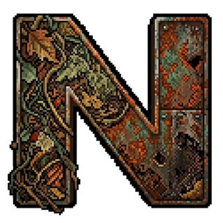

<p align="center">
  
</p>

<h1 align="center">amigo-native</h1>

<p align="center">
  <a href="https://github.com/amigo-labs/amigo-native/actions/workflows/ci.yml"></a>
  <a href="https://github.com/amigo-labs/amigo-native/blob/main/LICENSE"></a>
</p>

Monorepo of Rust-powered npm packages under `@amigo-labs`, built with [napi-rs](https://napi.rs). See the [dashboard](https://amigo-native.amigo-labs.workers.dev/) for the package catalog, benchmarks, and install instructions.

## Quick start

```bash
pnpm install
pnpm build
pnpm test
pnpm bench     # performance benchmarks
```

## Development

### Prerequisites

- Rust (edition 2024)
- Node.js >= 22
- pnpm

### Build

```bash
pnpm build          # all packages, release
pnpm build:debug    # all packages, debug (faster compile)
```

### Test

```bash
cargo test --workspace   # Rust unit tests
pnpm test                # Node.js tests (vitest)
```

### Benchmark

```bash
pnpm bench                                          # run all benchmarks (vitest bench)
pnpm bench:report                                   # run all benchmarks + size + parity, regenerate shards
node scripts/run-benchmarks.mjs --crates xxhash     # only this crate; writes bench-results-xxhash.json at repo root
node scripts/run-benchmarks.mjs --only-changed      # crates whose source changed vs origin/main
node scripts/generate-report.mjs                    # rebuild docs/data.json, generate docs/benchmarks/*.json, append history from fresh shards
```

CI does the same thing automatically: on each push to `main` it benches only the crates whose
`crates/<name>/` changed in that commit. Force a full rerun (e.g. after a toolchain bump) by
putting `[full-bench]` anywhere in the merge commit message.

### Lint

```bash
pnpm lint    # oxlint + cargo fmt --check + cargo clippy
```

## Adding a new package

```bash
./scripts/new-package.sh <package-name>
```

Then edit `crates/<name>/src/lib.rs` and `crates/<name>/Cargo.toml`.

## Architecture

```
amigo-native/
├── crates/
│   ├── <package>/        # one directory per @amigo-labs/<package> (see Packages table above)
│   └── _template/        # scaffold for new packages
├── scripts/
│   ├── new-package.sh         # package generator
│   ├── run-benchmarks.mjs
│   ├── measure-size.mjs
│   ├── generate-report.mjs    # rebuild docs/data.json
│   ├── sync-registry.mjs      # single-source-of-truth registry sync
│   └── conformance-summary.mjs
├── .github/workflows/
│   ├── ci.yml            # lint + test + benchmark (on main)
│   └── release.yml       # cross-compile + npm publish
├── wrangler.toml         # docs/ dashboard → Cloudflare Worker (Git integration)
├── Cargo.toml            # workspace root
└── vitest.config.ts
```

Each crate is a standalone npm package with:

- Rust source in `src/lib.rs`
- napi-rs bindings (`#[napi]` macros)
- Platform-specific npm packages in `npm/` (6 targets)
- Tests in `__test__/`, upstream conformance tests in `__conformance__/`, benchmarks in `__bench__/`
- `MIGRATION.md` when the package is not a 100% drop-in replacement

## Release

Tag with `<crate-name>@<version>` (e.g. `slugify@0.1.0`) to trigger the release workflow. It cross-compiles for 6 targets and publishes to npm with provenance.

| Target                      | OS             | Arch  |
| :-------------------------- | :------------- | :---- |
| `x86_64-unknown-linux-gnu`  | Linux          | x64   |
| `x86_64-unknown-linux-musl` | Linux (Alpine) | x64   |
| `aarch64-unknown-linux-gnu` | Linux          | ARM64 |
| `x86_64-apple-darwin`       | macOS          | x64   |
| `aarch64-apple-darwin`      | macOS          | ARM64 |
| `x86_64-pc-windows-msvc`    | Windows        | x64   |

## License

MIT
